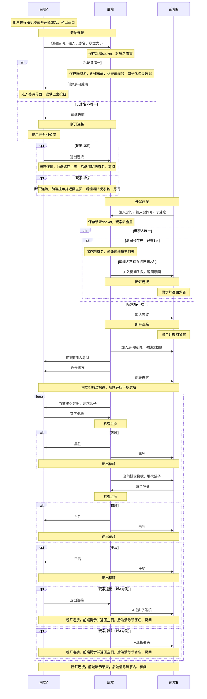

```mermaid
sequenceDiagram
    participant A as 前端A
    participant C as 后端

    Note over A: 用户选择联机模式并开始游戏，弹出窗口
    Note over A, C: 开始连接

    A ->> C: 创建房间，输入玩家名、棋盘大小
    Note over C: 保存玩家socket，玩家名查重
    alt 玩家名唯一
        Note over C: 保存玩家名，创建房间，记录房间号，初始化棋盘数据
        C ->> A: 创建房间成功
        Note over A: 进入等待界面，提供退出按钮
    else 玩家名不唯一
        C ->> A: 创建失败
        Note over A, C: 断开连接
        Note over A: 提示并返回弹窗
    end
    opt 玩家退出
        A ->> C: 退出连接
        Note over A, C: 断开连接，前端返回主页，后端清除玩家名、房间
    end
    opt 玩家掉线
        Note over A, C: 断开连接，前端提示并返回主页，后端清除玩家名、房间
    end

    participant B as 前端B

    Note over B, C: 开始连接
    B ->> C: 加入房间，输入房间号、玩家名
    Note over C: 保存玩家socket，玩家名查重
    alt 玩家名唯一
        alt 房间号存在且只有1人
            Note over C: 保存玩家名，修改房间玩家列表
        else 房间名不存在或已满2人
            C ->> B: 加入房间失败，返回原因
            Note over B, C: 断开连接
            Note over B: 提示并返回弹窗
        end
    else 玩家名不唯一
        C ->> B: 加入失败
        Note over B, C: 断开连接
        Note over B: 提示并返回弹窗
    end
    
    C ->> B: 加入房间成功，附棋盘数据
    C ->> A: 前端B加入房间
    C ->> A: 你是黑方
    C ->> B: 你是白方
    Note over A, B: 前端切换至棋盘，后端开始下棋逻辑

    loop
        C ->> A: 当前棋盘数据，要求落子
        A ->> C: 落子坐标
        Note over C: 检查胜负
        alt 黑胜
            C ->> A: 黑胜
            C ->> B: 黑胜
            Note over A, B: 退出循环
        end
        C ->> B: 当前棋盘数据，要求落子
        B ->> C: 落子坐标
        Note over C: 检查胜负
        alt 白胜
            C ->> A: 白胜
            C ->> B: 白胜
            Note over A, B: 退出循环
        end
        
        opt 平局
            C ->> A: 平局
            C ->> B: 平局
            Note over A, B: 退出循环
        end

        opt 玩家退出（以A为例）
            A ->> C: 退出连接
            C ->> B: A退出了连接
            Note over A, B: 断开连接，前端提示并返回主页，后端清除玩家名、房间
        end
        opt 玩家掉线（以A为例）
            C ->> B: A连接丢失
            Note over A, B: 断开连接，前端提示并返回主页，后端清除玩家名、房间
        end
    end
    Note over A, B: 断开连接，前端展示结果，后端清除玩家名、房间
```